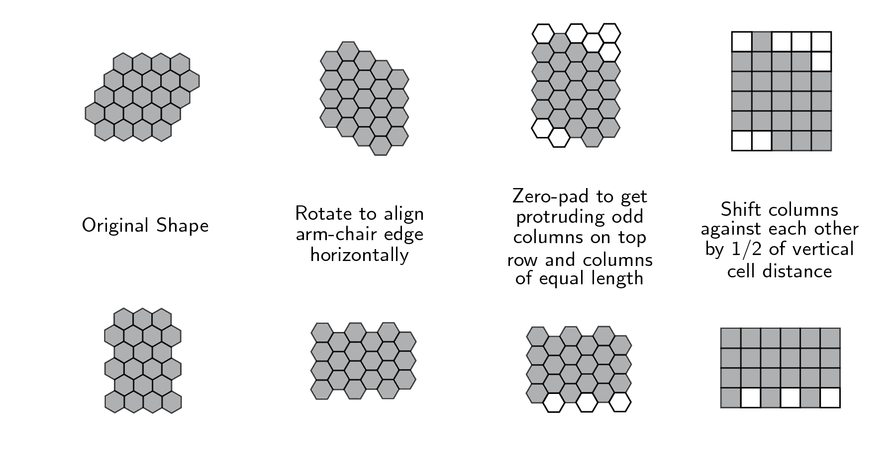
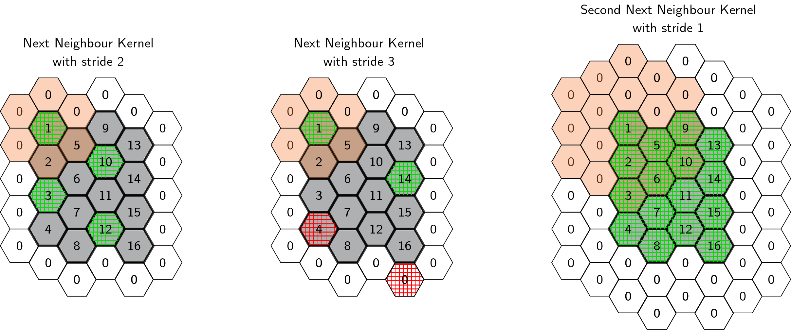
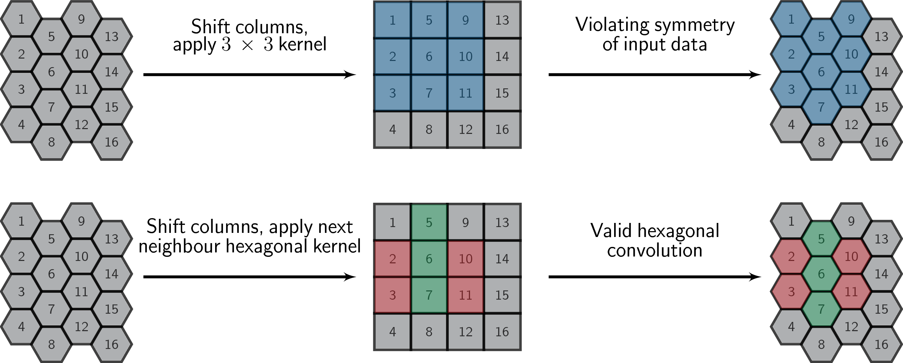
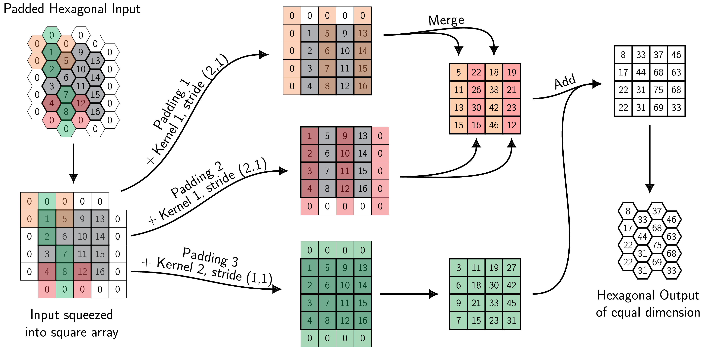

# HexagDLy - Processing Hexagonal Data with PyTorch

HexagDLy provides convolution and pooling methods for hexagonally sampled input data on the basis of the deep learning framework [PyTorch](https://github.com/pytorch/pytorch).

- [Getting Started](#getting-started)
   - [Prerequisites](#prerequisites)
   - [Installation](#installation)
- [Preparing the Data](#preparing-the-data)
- [How to use HexagDLy](#how-to-use-hexagdly)
- [General Concept](#general-concept)
- [Disclaimer](#disclaimer)


## Getting Started

HexagDLy is used on top of the PyTorch deep learning framework. If PyTorch is installed, it should be enough to add the file hexagdly.py to your $PYTHONPATH in order to use the functionalities provided by HexagDLy.

### Prerequisites

As only prerequisite, [PyTorch](https://github.com/pytorch/pytorch) has to be installed. Please visit the PyTorch website http://pytorch.org/ or github page https://github.com/pytorch/pytorch and follow the installation instructions.


### Installation

The most convenient way of using the methods provided by HexagDLy is to add the file hexagdly.py to your system's $PYTHONPATH. To do so, please clone this repository or save the file hexagdly.py somewhere on your system and add the following line to your .bashrc or .bash_profile:

```
export PYTHONPATH='/path/to/hexagdly.py':$PYTHONPATH
```

and be sure to source the changes.


## Preparing the Data

A crucial point is the correct translation of the hexagonal data points to a square-grid tensor in order to ensure valid hexagonal convolution and pooling operations with HexagDLy. To get the data into the required shape, the hexagonal array has to be aligned horizontally along an arm-chair edge (edge along the flat sides of the hexagons). The top row has to depict a protruding cell (an arm of the armchair edge) on every **odd** column including the first. 
If necessary, missing cells have to be filled with zeros.
Furthermore, every column should have the same number of cells. If that is not the case, missing cells also have to be filled with zeros.

The resulting hexagonal grid of data points has to be translated to a square grid by shifting its columns by 1/2 of the vertical cell distance against each other. Figuratively, this can be understood as *squeezing* the hexagonal data points into a square grid.

The image below shows the individual steps to translate data points from a hexagonal to a square grid as expected by HexagDLy:



The squeezed array can have arbitrary numbers of rows and colunms.


## How to use HexagDLy

If the input data has the required layout as shown in [Preparing the Data](#preparing-the-data) and HexagDLy is correctly linked to your $PYTHONPATH, performing hexagonal convolutions is as easy as the following example:

```
import torch
import hexagdly

kernel_size, stride = 1, 4

hexconv = hexagdly.conv2d(1, 3, kernel_size, stride)
input = torch.rand(1,1,21,21)
output = hexconv(input)
```

In this example, a random input tensor of shape (1, 1, 21, 21) is convolved with a so called next neighbour hexagonal kernel with one input channel and three output channels, using a stride of four. The output is a tensor of shape (1, 3, 5, 6). 

HexagDLy is desinged to conserve the hexagonal symmetry of the input. Therefore, a hexagonal kernel is always symmetric around a cell in the kernel's center. The size of the kernel thereby refers to the number of covered neighbour cells from the center along the three symmetry axes of the hexagonal grid.
The stride of a kernel is defined in the same way. 
An automatic padding is furthermore applied, depending on the chosen kernel size, stride and size of the input. 
The image below shows examples of how kernels of different size and stride visit certain regions of an input. The orange cells mark the hexagonal kernel centered on the top left cell, the starting point of each operation. The square gridlines depict cells on which the kernel is centered by moving it with the given stride.



**Please note**: Operations are only performed where the center point of a kernel is located within the input tensor. This could result in output columns of different length. In such cases the output will be sliced according to the shortest column. An example is the convolution with stride 3 in the center of the figure above. The red gridlines depict convolutions that are disrecaded in the output.


## General Concept 

As common deep learning frameworks are designed to process data arranged in square grids, it is not (yet) possible out-of-the-box to process data points that are arranged on a hexagonal grid.
To process hexagonally sampled data with frameworks like PyTorch, it is therefore necessary to translate the information from the hexagonal grid to a square grid layout.
Such a conversion is however not trivial, as the two lattices show different symmetries, i.e. 6-fold symmetry for the hexagonal lattice and 4-fold symmetry for the square lattice.

One way to get information from a hexagonal to a square grid is by resampling the data e.g. via interpolation or rebinning to a square grid. To limit the loss of information (especially spatial information), the resolution has to be increased, which inflates the size of the data and increases the required computing resources.

Another way is to rearrange the data points to a square grid and adapt the square-grid operations applied on this data to conserve the symmetry of the hexagonal lattice. 
Following this approach, HexagDLy is based on the construction of custom kernels consisting of square sub-kernels.
Combining the output of these sub-convolutions is then equivalent to performing hexagonal convolutions.

In the first step, the hexagonal data has to be rearranged (*squeezed*) to a square grid as shown in [Preparing the Data](#preparing-the-data). Regular square convolution and pooling operations can be performed on the resulting array.
A standard next-neighbour (NN) convolution in a square grid uses a kernel of size 3x3, spanning the four direct edge and four direct corner neighbours of a data point. This is different in a hexagonal grid where every point has only six direct edge neighbours. 
The application of a square NN kernel thus disregards the original pixel-to-pixel neighbour relation and breaks the 6-fold symmetry. In order to perform a valid hexagonal convolution, it is therefore necessary to split the NN kernel into sub-kernels that, in combination, cover the true neighbours of a data point in the hexagonal grid as depicted in the image below:



Due to the alternating shift between the columns of the squeezed array, the sub-kernels of a hexagonal convolution kernel have to shift accordingly, depending on whether the kernel is centered on an odd or an even column of the array. 
A full NN hexagonal convolution with conserved dimensions can be broken down into a total of three sub-convolutions that are performed by applying two different sub-kernels on three differently padded versions of the input. The resulting arrays are then merged and added to obtain the desired result.
The individual steps of such a hexagonal NN convolution are depicted in the image below, where a toy input tensor is convolved with a hexagonal NN kernel (all weights set to 1, i.e. the convolution adds up all data points covered by the kernel):



Following the same concept, it is feasible to construct larger hexagonal convolution kernels like second next-neighbour (2NN), third next-neighbour (3NN) up to *n*<sup>th</sup> next-neighbour (*n*NN) kernels, with an according *n*+1 sub-kernels that span a total of 1+3*n*(*n*+1) data points.
With this implementation of hexagonal kernels, it is possible to implement pooling operations by increasing the strides of the sub-kernels and exchanging the convolution operations with nested pooling methods.


## Disclaimer

HexagDLy is built as an easy-to-use prototyping tool to design convolutional neural networks for hexagonally sampled data. The implemented methods rather aim for flexibility then for performance.
Once a model is optimized, it is possible to hard-code the desired parameters like kernel size, stride and input dimensions to make the implementation faster.
Furthermore, the [General Concept](#general-concept) is not specific to PyTorch but can be adapted to other deep learning frameworks.


## Authors

* **Tim Lukas Holch**
* **Constantin Steppa**

See also the list of [contributors](https://github.com/ai4iacts/hexagdly/contributors) who participated in this project.


## License

This project is licensed under the MIT license - please consult the [LICENSE](LICENSE) file for details.


## Acknowledgments

This project evolved by exploring new analysis techniques for Imaging Atmospheric Cherenkov Telescopes with the High Energy Stereoscopic System (H.E.S.S.). We would like to thank the members of the H.E.S.S. collaboration for their support.


